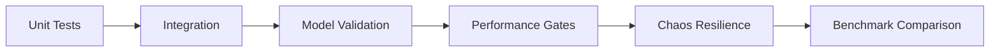

# SynapseStream Testing Guidelines

## 1. Introduction
Effective testing is paramount for maintaining SynapseStream's integrity as a real-time neural processing framework. This document establishes standardized approaches for verifying functional correctness, stream processing reliability, and continuous learning capabilities. All contributions must adhere to these validation protocols before integration.

## 2. Testing Scope
### 2.1 Core Verification Areas
- Neural module weight convergence
- Stream processing pipeline integrity
- Event-time semantics enforcement
- State management under backpressure
- Model version transition consistency
- Recovery from checkpoint failures

### 2.2 Compatibility Matrix
| Component         | Target Environments         |
|-------------------|-----------------------------|
| Stream Processors | Flink 1.16+, Kafka Streams  |
| Neural Runtimes   | ONNX v1.12+, TorchScript    |
| Data Formats      | Arrow Streaming, Protobuf   |

## 3. Testing Types & Methodologies

### 3.1 Unit Testing
**Pattern Requirements:**
```python
# Example neural module test
def test_autoencoder_convergence():
    test_stream = SyntheticDataStream(distribution="multimodal")
    module = Autoencoder(latent_dim=4)
    with StreamTestHarness(module) as harness:
        harness.process_stream(test_stream.sample(n=1000))
        assert harness.output_metric("reconstruction_error") < 0.15
```

**Key Standards:**
- Minimum 90% branch coverage for stateful operators
- Mock watermark advancement in event-time tests
- Validate serialization/deserialization symmetry

### 3.2 Integration Testing
**Stream Topology Validation:**
```bash
spytest --kafka-embedded --parallelism 4 \
  -c "tests/integration/stream_topologies/"
```

**Verification Checklist:**
- [ ] Exactly-once semantics across reboots
- [ ] Dynamic partition redistribution
- [ ] Checkpoint alignment during scale-out
- [ ] Schema evolution compatibility
- [ ] Backpressure propagation signals

### 3.3 Stream Processing Validation
**Temporal Assertions Table:**
| Assertion Type           | Tooling Reference            |
|--------------------------|------------------------------|
| Output Watermark Liveness | `WatermarkValidator`         |
| Event-Time Skew Analysis | `StreamEventProfiler`        |
| Late Data Handling        | `AllowedLatenessMonitor`     |

### 3.4 Performance Benchmarking
**Load Profile Definitions:**
```yaml
# perf/profiles/throughput.yml
event_rate: 1M/s
payload_size: 1-5KB
processing_latency:
  p99: <250ms
  max: <2s
resource_utilization:
  cpu: <70%
  memory: <8GB
```

## 4. Coverage Requirements
```bash
# Coverage enforcement command
make coverage-check MIN_COVERAGE=85 EXCLUDE="contrib/*,legacy/*"
```

**Coverage Exemption Rules:**
1. Protobuf-generated code
2. Platform-specific native bindings
3. Experimental modules (PREVIEW flag)

## 5. Tooling Configuration
### 5.1 Core Test Stack
```python
# pytest.ini configuration
[pytest]
markers =
    slow: marks tests as slow (deselect with -m "not slow")
    perf: performance benchmarks
    streaming: streaming data dependencies
asyncio_mode = auto
```

### 5.2 Specialized Tooling
**Chaos Engineering Setup:**
```bash
chaos run --rollback-strategy=always experiments/network-partition.json
```

**Drift Detection:**
```python
from synapse.monitoring import ConceptDriftDetector

drift_monitor = ConceptDriftDetector(
    reference_window=test_stream[0:1000],
    detection_window=test_stream[1000:2000],
    threshold=0.05
)
assert not drift_monitor.detected_significant_drift()
```

## 6. Best Practices
1. **Temporal Decoupling:**  
   Use `VirtualClock` for deterministic event-time progression

2. **Model Consistency:**
   ```python
   ModelComparator.compare_versions(
       v1=baseline_model,
       v2=candidate_model,
       test_data=validation_stream,
       epsilon=0.001
   )
   ```

3. **Reproducibility Protocol:**
   - Seed all RNGs with `--test-seed` CLI parameter
   - Store test artifacts in `/test-output/{commit_hash}`
   - Version-lock all data dependencies

## 7. CI/CD Integration
**Pipeline Stages:**


**Quality Gates:**
- Model accuracy degradation < 1.5%
- P99 latency increase < 10%
- Watermark advancement delay < 15s

## 8. Reporting Standards
**Mandatory Artifacts:**
1. JUnit-compatible test reports
2. Coverage XML (Cobertura format)
3. Neural confidence matrix
4. Stream topology graphs
5. Resource utilization heatmaps

**Visualization Requirements:**
```python
# In test reports
BenchmarkPlotter.visualize(
    metrics=["throughput", "latency"],
    dimensions=["worker_count", "batch_size"],
    output_format="interactive_html"
)
```

## 9. Review Process
1. All test code requires sign-off by:
   - Module owner
   - Streaming systems lead
   - Machine learning architect

2. Performance tests must demonstrate:
   - Linear scalability to 16 nodes
   - Sub-second failover recovery
   - <3% accuracy drop during upgrade transitions

## 10. Resources
- [Stream Testing Patterns Handbook](https://internal.wiki/testing-streams)
- [Neural Test Data Generation Guidelines](https://internal.wiki/test-data-gen)
- [Reference Testing Architecture Diagrams](https://internal.wiki/test-architecture)

---

**Acknowledgments:**  
Adapted from IEEE 29119-4 systematic testing methodology and Kafka Streams verification patterns.