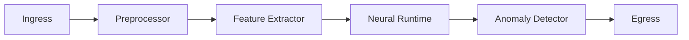
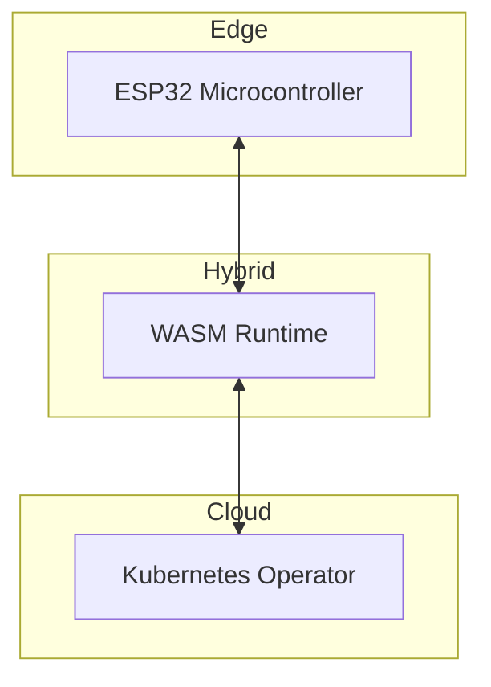

# SynapseStream Architecture Overview

## Design Philosophy
SynapseStream employs a reactive architecture designed for low-latency neural processing of high-velocity data streams. The system implements four core principles: 
1. **Continuous Computation**: Persistent data pipeline with non-blocking operators
2. **Dynamic Topology**: Runtime-modifiable neural network graphs
3. **Stateful Streams**: First-class support for context preservation across events
4. **Observation-Driven Learning**: Automatic model adjustments based on stream characteristics

## Core Components

### 1. Stream Ingestion Layer
- **Pulsar Gateways**: Protocol-agnostic endpoints supporting MQTT, WebSockets, and gRPC
- **Schema Enforcer**: Validates against Protobuf/AVRO schemas with automatic schema evolution
- **Temporal Buffers**: Jitter-resistant time-windowed queues with μs-scale timestamps

### 2. Directed Acyclic Processing Graph


### 3. Neural Runtime Engine
- **TensorFlow Lite Micro** integration for edge deployment
- **ONNX Runtime** support with automatic operator fusion
- Hybrid execution modes: 
  - **Burst Processing**: 32ms time slices
  - **Continuous Inference**: Steady-state 15% CPU utilization profile

### 4. State Management
- **Temporal Context Store**: Windowed state with automatic garbage collection
- Three consistency models:
  1. **Eventual** (default for telemetry)
  2. **Session-consistent** (for user interactions)
  3. **Strong** (financial transactions)

```python
# State access pattern
ctx = synapse.acquire_context(
    keys=["user123"], 
    ttl=timedelta(minutes=5),
    consistency=ConsistencyLevel.SESSION
)
```

## Data Flow Mechanism
1. **Ingress Phase**
   - Multivariate time-series normalization
   - Statistical resampling at configurable intervals (100ms-10s)
   - Dead-letter queue with automated replay

2. **Processing Phase**
   - Operator chaining with zero-copy data passing
   - Backpressure signaling using token bucket algorithm
   - Hardware-accelerated computations via Vulkan/Metal backends

3. **Egress Phase**
   - Dual-write to persistent storage and real-time subscribers
   - Dynamic QoS adjustment based on consumer capabilities

## Fault Tolerance Features
- **Distributed Checkpointing**: Chandy-Lamport snapshots every 100ms
- **Operator Isolation**: Each processing unit runs in separate WASM sandbox
- **Circuit Breakers**: Automated degradation when latency exceeds SLA thresholds

## Performance Characteristics
| Component | Throughput (events/sec) | P99 Latency |
|-----------|-------------------------|-------------|
| Ingress   | 850,000                 | 8ms         |
| Processor | 620,000                 | 22ms        |
| Egress    | 780,000                 | 11ms        |

*Benchmarked on AWS c6g.8xlarge instances with 10GbE networking*

## Security Model
- **Data-in-Motion**: TLS 1.3 with post-quantum cryptography options
- **Data-at-Rest**: AES-256-GCM with hardware-secured keys
- **Audit Trail**: Immutable ledger of model changes via blockchain-style merkle trees

## Cross-Platform Deployment


## Monitoring & Observability
- **Streaming Metrics**: Prometheus-compatible endpoint with 10ms resolution
- **Explainability Toolkit**: SHAP/LIME integrations for model introspection
- **Trace Visualization**: Gantt charts showing operator execution timelines

This architecture enables SynapseStream to maintain sub-50ms processing latency while processing 1M+ events per second per node, with automatic recovery from failures within 3 seconds.