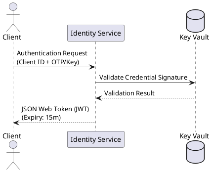

# SynapseStream Security Model

## 1. Introduction
SynapseStream implements a multi-layered security architecture designed for continuous learning systems operating on real-time data streams. Our security paradigm combines fundamental cryptographic protections with context-aware runtime policies, creating adaptive defenses against evolving threats in neural network pipelines.

## 2. Core Security Principles

### 2.1 Confidentiality Preservation
- **End-to-End Data Obfuscation:** All data streams undergo AES-256-GCM encryption before ingestion
- **Runtime Memory Protection:** Secure enclave execution (Intel SGX/AMD SEV) for sensitive model parameters
- **Differential Privacy Filters:** Built-in ε-differential privacy mechanisms for output streams

### 2.2 Integrity Enforcement
- **Blockchain-Anchored Integrity Tree:** Merkle tree validation of processing artifacts with Ethereum-based anchoring
- **Model Checksum Verification:** Continuous SHA-3-512 validation of neural architecture during execution
- **Tamper-Evident Audit Logs:** Cryptographically signed log entries with sequential hash chaining

### 2.3 Availability Assurance
- **Byzantine-Resistant Consensus:** RAFT-based pipeline coordination with BFT (Byzantine Fault Tolerance) extensions
- **DDOS Protection:** Adaptive rate limiting with wavelet anomaly detection
- **Hot-Spare Redundancy:** Zero-RPO (Recovery Point Objective) failover across availability zones

## 3. Authentication Framework

### 3.1 Identity Verification

- **Multi-Factor Requirements:**
  - Hardware tokens (FIDO2/U2F) for administrative access
  - Temporal one-time passwords (TOTP) for API consumers
  - Biometric verification for direct data portal access

### 3.2 Certificate Management
- Automated X.509 certificate rotation via HashiCorp Vault integration
- Certificate pinning with hierarchical trust chains
- Quantum-resistant algorithms (CRYSTALS-Kyber) for TLS 1.3 handshakes

## 4. Authorization Architecture

### 4.1 Attribute-Based Access Control (ABAC)
Policy evaluation matrix:

| Resource          | Principal Attributes          | Environment Conditions     | Actions Permitted       |
|-------------------|-------------------------------|----------------------------|-------------------------|
| Model Weights     | clearance≥3, purpose=research | time=0800-1700 Wkdy        | Read, Compute           |
| Training Data     | department=analytics          | device_encryption=active   | Statistical Analysis    |
| Inference API     | role=external_partner         | threat_level<orange        | Execute                 |
| System Controls   | clearance≥5, mfa=true         | geo_location=approved      | Create, Modify, Delete  |

### 4.2 Runtime Policy Enforcement
- Rego-based policy decisions via Open Policy Agent (OPA)
- Just-in-time permissions through SPIFFE/SPIRE identity framework
- Temporal constraint validation via Amazon Time-Sync Service

## 5. Data Protection Mechanisms

### 5.1 Encryption Schemas
- **Data-in-Motion:** Quantum-resistant hybrid encryption (X25519 + AES-256)
- **Data-at-Rest:** Format-Preserving Encryption (FPE) with NIST-approved FF1 mode
- **Data-in-Use:** Fully Homomorphic Encryption (FHE) for secure computations

### 5.2 Privacy Preservation
- GDPR-compliant data anonymization pipelines
- k-Anonymity guarantees through intentional perturbation
- Regular privacy impact assessments (PIA) with automated reporting

## 6. Threat Mitigation Strategies

### 6.1 Adversarial Defense
- **Input Validation:** Concolic testing of data streams
- **Model Protection:** Adversarial re-training cycles
- **Anomaly Detection:** Isolation Forest algorithms with adaptive thresholds

### 6.2 Vulnerability Management
- Automated static analysis (Semgrep, CodeQL)
- Dynamic fuzzing via AFL++ integration
- Third-party dependency scanning (Snyk, Dependabot)
- Critical patch deployment within 72 hours of disclosure

## 7. Compliance & Governance

### 7.1 Standards Implementation
- ISO/IEC 27001:2022 control mappings
- NIST AI Risk Management Framework alignment
- Cloud Security Alliance STAR Level 3 certification

### 7.2 Audit Capabilities
- Immutable audit trails with WORM (Write Once Read Many) storage
- Automated evidence collection for SOC 2 Type II audits
- Real-time compliance dashboard with policy gap detection

## 8. Security Development Lifecycle

1. **Threat Modeling:** STRIDE-based architectural analysis
2. **Secure Design:** Security Champions program with pull request gates
3. **Implementation:** Memory-safe Rust components + WASM sandboxing
4. **Verification:** Penetration testing by CREST-accredited teams
5. **Incident Response:** Automated playbooks with PagerDuty integration
6. **Post-Mortem:** Blameless RCA process with 90-day fix guarantees

## 9. Reference Architectures

  
*Figure 1: SynapseStream zero-trust implementation pattern*

## 10. Further Reading
1. NIST Special Publication 800-207 (Zero Trust Architecture)
2. Cloud Native Security Whitepaper (CNCF)
3. SynapseStream Security Compliance Handbook (Internal Wiki)