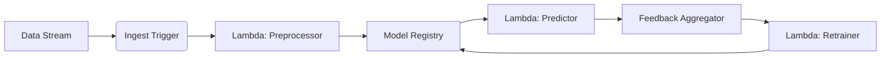

# Serverless Deployment of SynapseStream Framework

## Introduction
This guide provides a comprehensive methodology for deploying SynapseStream in serverless computing environments. The architecture leverages event-driven execution to enable cost-efficient, scalable neural network processing for continuous learning workflows.

## Learning Objectives
1. Configure SynapseStream components for serverless execution
2. Implement streaming data ingestion patterns
3. Optimize model performance under serverless constraints
4. Establish continuous learning feedback loops

## Prerequisites
- SynapseStream Core v2.3+  
- Serverless Framework v3.25+  
- AWS Lambda (Python 3.10 runtime) or equivalent FaaS provider  
- Streaming data source (Kinesis, Pub/Sub, or Kafka)  

## Deployment Architecture
### Recommended Pattern


## Configuration Steps
### 1. Environment Setup
```bash
# Install serverless CLI
npm install -g serverless

# Configure AWS credentials
serverless config credentials --provider aws --key AKIA... --secret ...
```

### 2. Function Definitions
`serverless.yml` configuration:
```yaml
functions:
  preprocessor:
    handler: handler.preprocess
    memorySize: 2048  
    timeout: 120
    events:
      - stream:
          arn: arn:aws:kinesis:us-east-1:XXXXXX:stream/synapse-input
          batchSize: 100
          startingPosition: LATEST

  predictor:
    handler: handler.predict
    memorySize: 3008  
    environment:
      MODEL_ENDPOINT: ${env:MODEL_S3_URI}

  retrainer:
    handler: handler.retrain
    memorySize: 10240  
    timeout: 900
    environment:
      TRAINING_DATA_BUCKET: ${env:TRAINING_BUCKET}
```

### 3. Deployment Constraints Consideration
| Factor               | Recommendation          | Rationale                     |
|----------------------|-------------------------|-------------------------------|
| Memory Allocation    | ≥3GB for Predictor      | Neural network initialization |
| Ephemeral Storage    | ≥10GB for Retrainer     | Batch gradient computations   |
| Concurrency Limit    | 2-3x peak load          | Cold start mitigation         |
| Execution Timeout    | 15min (retrain cycles)  | Backpropagation requirements  |

## Continuous Learning Implementation
```python
# handler.py
import synapse_stream as ss

def predict(event, context):
    model = ss.load_model(os.environ['MODEL_ENDPOINT'])
    predictions = []
    
    for record in event['Records']:
        payload = ss.decompress(record['kinesis']['data'])
        input_tensor = ss.transform(payload)
        result = model.predict(input_tensor)
        
        # Queue feedback for retraining
        ss.queue_feedback(
            input=input_tensor,
            prediction=result,
            timestamp=record['approximateArrivalTimestamp']
        )
        
        predictions.append(result)
    
    return predictions
```

## Performance Optimization
1. **Cold Start Mitigation**
   - Provisioned concurrency for predictor functions
   - Layer optimization for framework dependencies
   - Model preloading in `INIT` phase

2. **Data Pipeline Tuning**
   - Adaptive batching (64-128 samples/batch)
   - Binary protocol encoding
   - Predictive scaling based on queue depth

3. **Gradient Aggregation**
```python
def retrain(event, context):
    aggregator = ss.GradientAccumulator(
        window_size=os.environ['UPDATE_WINDOW'],
        reconciliation='mean'
    )
    
    for feedback_batch in ss.read_feedback(min_batch_size=256):
        gradients = [
            calculate_gradients(batch)
            for batch in feedback_batch
        ]
        
        aggregated = aggregator.process(gradients)
        current_weights = ss.load_model_weights()
        
        updated_weights = apply_gradient_update(
            current_weights,
            aggregated,
            learning_rate=0.001
        )
        
        ss.commit_update(updated_weights)
```

## Validation Procedure
1. Throughput Test:
```bash
artillery quick --count 1000 -n 50 \
  "https://api.execute-api.us-east-1.amazonaws.com/predict"
```

2. Learning Convergence Check:
```python
assert abs(previous_loss - current_loss) < convergence_threshold, 
    "Model failed to converge in serverless environment"
```

3. Fallback Mechanism Verification
```yaml
# serverless.yml configuration
resources:
  Resources:
    FallbackQueue:
      Type: AWS::SQS::Queue
      Properties:
        QueueName: synapse-fallback-queue
```

## Best Practices
1. **Idempotency Enforcement**
   - Sequence tokens in stream records
   - Deduplication window configuration
   - Atomic weight updates

2. **Model Version Control**
```bash
synapse-cli versions register \
  --model-id convnet-3d \
  --s3-uri s3://models/v12/model.bin \
  --hash $(openssl sha256 model.bin)
```

3. **Security Considerations**
   - IAM least-privilege roles
   - KMS encryption for weight parameters
   - VPC isolation for training functions

## Troubleshooting
**Common Issue**: Prediction Latency Spikes  
**Resolution Checklist**:  
1. Verify provisioned concurrency activation  
2. Check model serialization overhead  
3. Monitor shared memory contention  
4. Validate input payload compression  

**Common Issue**: Gradient Divergence  
**Resolution Steps**:  
1. Verify floating point consistency across workers  
2. Check batch normalization layer states  
3. Validate learning rate scheduling  

## References
1. Serverless Neural Architecture Design Patterns (IEEE Transactions 2023)  
2. AWS Lambda Best Practices Guide v4.2  
3. SynapseStream Performance Whitepaper  

## Revision History
| Version | Date       | Author         | Changes               |
|---------|------------|----------------|-----------------------|
| 1.0     | 2023a-10-15| Engineering    | Initial release       |
| 1.1     | 2023a-11-02| ML Ops         | Added cold start fixes| 

## Conclusion
This deployment pattern enables efficient continuous learning without infrastructure overhead. For production workloads exceeding 100 RPS, consider hybrid deployments with dedicated model serving clusters while maintaining serverless preprocessing pipelines.